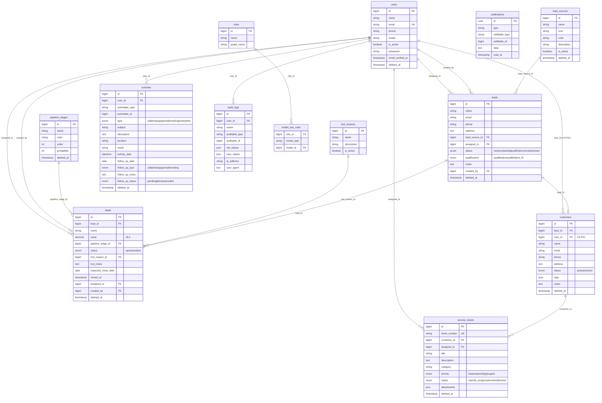
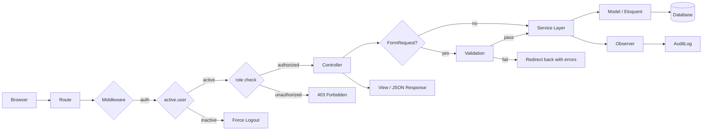
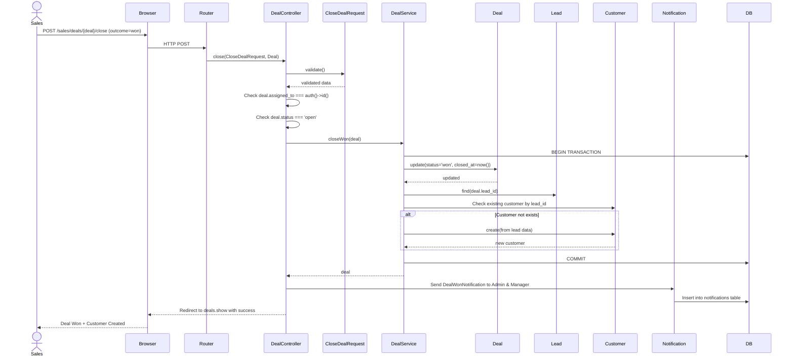
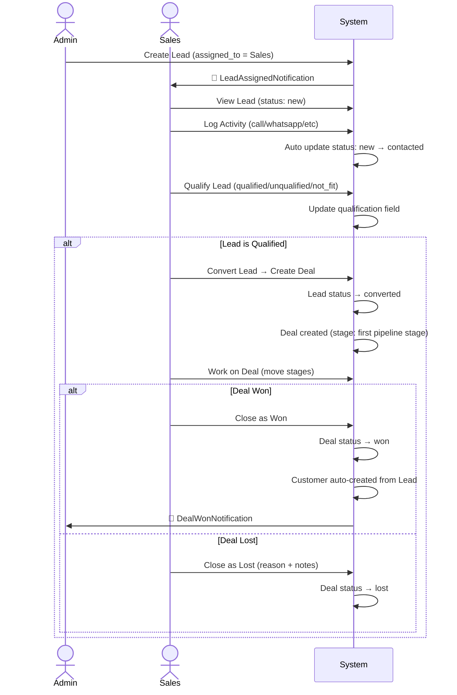
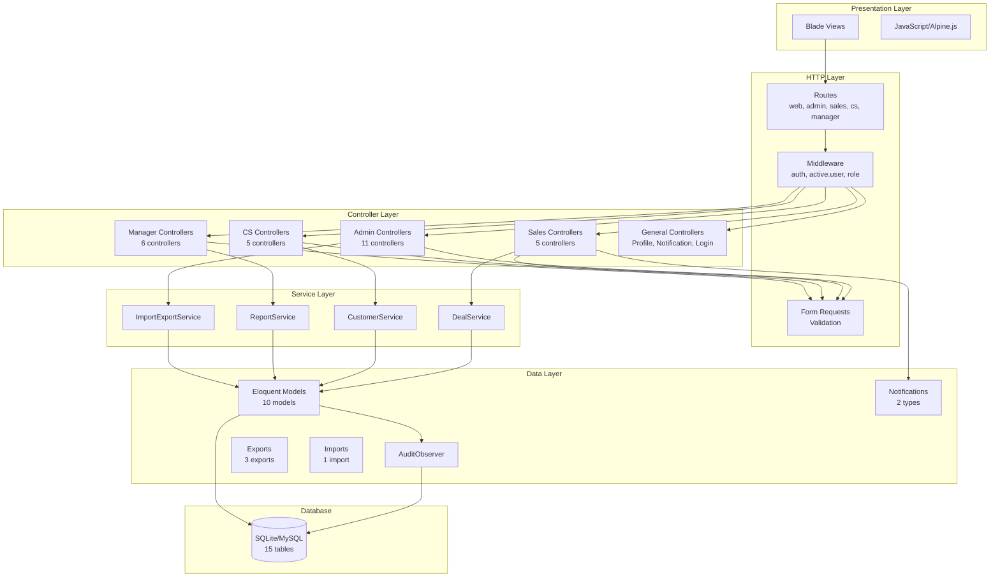
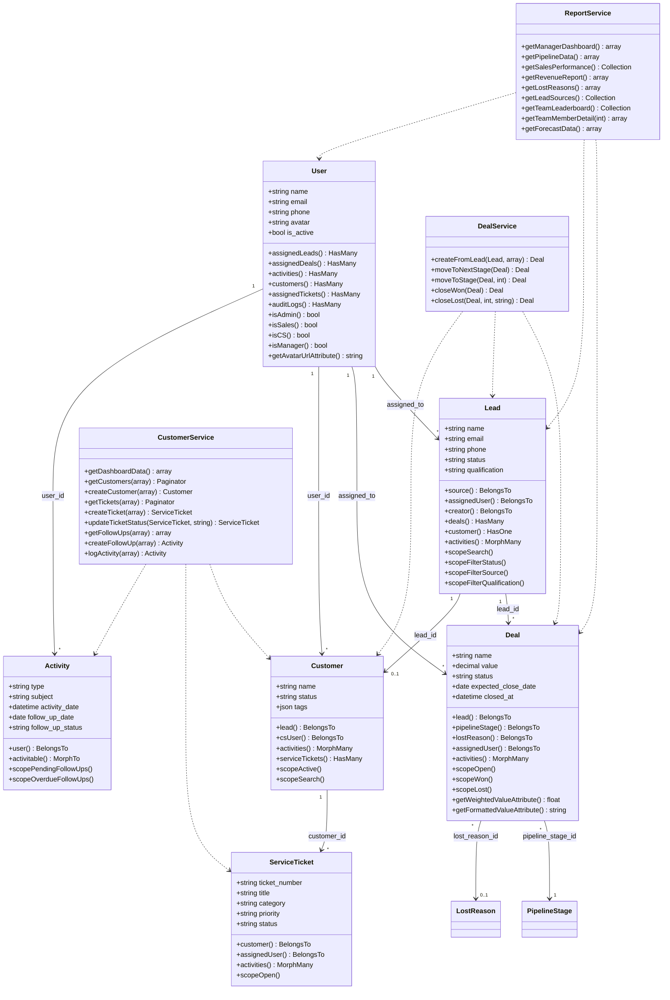
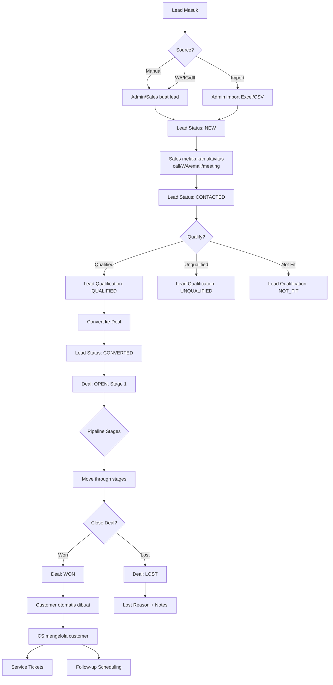
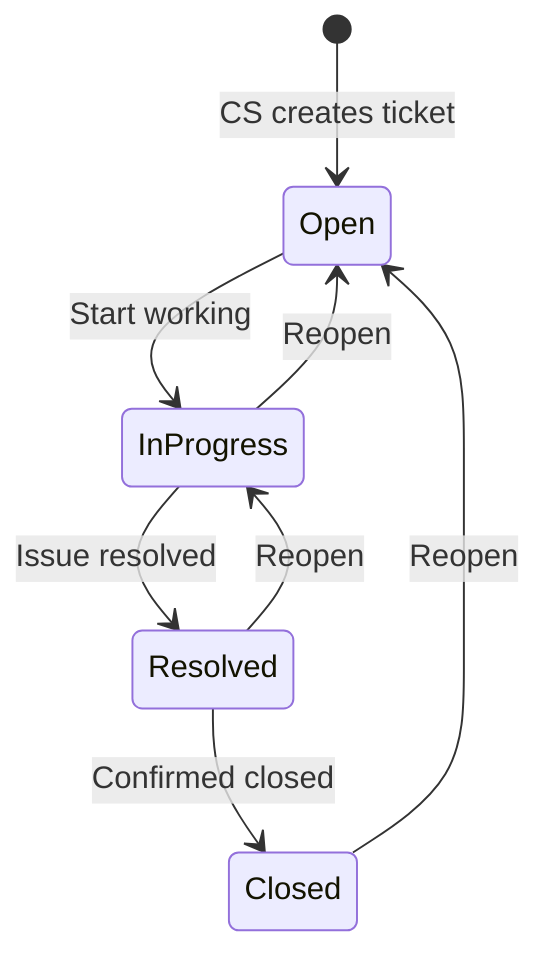

# 📊 Analisis Lengkap Project: BEAUTY_CRM

> Dokumen ini dihasilkan berdasarkan **analisis langsung source code**, bukan asumsi. Setiap informasi merujuk ke file sumber yang spesifik.

---

## 1. Ringkasan Fitur

BEAUTY_CRM adalah sistem **Customer Relationship Management** untuk industri kecantikan (beauty) yang dibangun menggunakan **Laravel** dengan arsitektur MVC + Service Layer. Sistem menggunakan **Spatie Permission** untuk manajemen role-based access control.

| # | Fitur | Deskripsi |
|---|-------|-----------|
| 1 | **Authentication** | Login/logout, session management, pengecekan akun aktif |
| 2 | **User Management** | CRUD user, role assignment, toggle aktif/nonaktif |
| 3 | **Lead Management** | CRUD leads, filtering, qualify, convert ke deal |
| 4 | **Deal/Pipeline** | CRUD deals, pipeline kanban, move stage, close won/lost |
| 5 | **Customer Management** | CRUD customer, tagging, CS assignment |
| 6 | **Activity Tracking** | Log aktivitas (call, WA, email, meeting), follow-up scheduling |
| 7 | **Service Tickets** | CRUD tiket layanan, status workflow, priority tracking |
| 8 | **Follow-up Management** | Jadwal follow-up, overdue tracking, complete marking |
| 9 | **Reports & Analytics** | Sales performance, revenue, lost reasons, lead sources, pipeline analysis |
| 10 | **Dashboard** | KPI cards, charts, trend analysis per role |
| 11 | **Import/Export** | Import leads via Excel/CSV, export leads & reports |
| 12 | **Audit Logging** | Automatic CRUD logging via Observer pattern |
| 13 | **Notifications** | Database notifications untuk lead assignment & deal won |
| 14 | **Settings** | Konfigurasi company info, notification toggles |
| 15 | **Forecast** | Revenue forecasting berdasarkan weighted pipeline value |
| 16 | **Profile** | Edit profil personal, avatar upload |

---

## 2. Arsitektur Role-Based Access

Berdasarkan [RoleSeeder.php](file:///c:/xampp/htdocs/BEAUTY_MAIN/BEAUTY_CRM/database/seeders/RoleSeeder.php):

| Role | Permissions | Dashboard Route |
|------|------------|-----------------|
| **Admin** | All permissions | `/admin/dashboard` |
| **Sales** | manage leads, manage deals, manage activities | `/sales/dashboard` |
| **Customer Service** | manage customers, manage tickets, manage activities | `/cs/dashboard` |
| **Manager** | view reports, view audit logs, manage pipeline | `/manager/dashboard` |

---

## 3. Analisis Per-Module

---

### 🔐 Module: Authentication

#### Tujuan
Mengelola autentikasi user (login/logout) dengan pengecekan status akun aktif.

#### Alur Bisnis
1. User mengakses `/login` → form login ditampilkan
2. Submit credentials → validasi email & password
3. Jika valid → cek `is_active` → jika aktif, redirect ke `/dashboard`
4. `/dashboard` melakukan redirect berdasarkan role user
5. Jika user di-deactivate di tengah session → `CheckActiveUser` middleware akan force logout

#### Route

| Method | URI | Controller | Name |
|--------|-----|-----------|------|
| GET | `/` | Redirect → login | - |
| GET | `/login` | [LoginController::showLoginForm](file:///c:/xampp/htdocs/BEAUTY_MAIN/BEAUTY_CRM/app/Http/Controllers/Auth/LoginController.php#L11-L17) | `login` |
| POST | `/login` | [LoginController::login](file:///c:/xampp/htdocs/BEAUTY_MAIN/BEAUTY_CRM/app/Http/Controllers/Auth/LoginController.php#L19-L42) | - |
| POST | `/logout` | [LoginController::logout](file:///c:/xampp/htdocs/BEAUTY_MAIN/BEAUTY_CRM/app/Http/Controllers/Auth/LoginController.php#L44-L50) | `logout` |

#### Request Validation
Inline di controller: `email` → required|email, `password` → required

#### Middleware
- [CheckActiveUser](file:///c:/xampp/htdocs/BEAUTY_MAIN/BEAUTY_CRM/app/Http/Middleware/CheckActiveUser.php) — memaksa logout jika `is_active = false`

#### Response
- Redirect ke `/dashboard` (yang kemudian redirect ke dashboard sesuai role)
- Atau error message jika login gagal / akun nonaktif

---

### 👤 Module: Profile

#### Tujuan
Memungkinkan user mengedit profil dan mengunggah avatar.

#### Route

| Method | URI | Controller | Name |
|--------|-----|-----------|------|
| GET | `/profile` | [ProfileController::edit](file:///c:/xampp/htdocs/BEAUTY_MAIN/BEAUTY_CRM/app/Http/Controllers/ProfileController.php#L12-L17) | `profile.edit` |
| PUT | `/profile` | [ProfileController::update](file:///c:/xampp/htdocs/BEAUTY_MAIN/BEAUTY_CRM/app/Http/Controllers/ProfileController.php#L19-L48) | `profile.update` |

#### Request Validation (inline)
- `name`: required, string, max:255
- `email`: required, email, unique (kecuali diri sendiri)
- `phone`: nullable, max:20
- `avatar`: nullable, image (jpeg/png/jpg/gif), max:2048

#### Tabel: `users`

---

### 🛡️ Module: Admin — User Management

#### Tujuan
Admin mengelola semua user: buat, lihat, edit, hapus, toggle aktif.

#### Alur Bisnis
1. Admin melihat daftar user dengan filter (search, role, status)
2. Admin membuat user baru dengan role assignment
3. Admin mengedit user (Manager tidak bisa diedit, hanya di-toggle)
4. Admin men-delete user (tidak bisa delete diri sendiri atau Manager)
5. Admin toggle aktif/nonaktif user via AJAX

#### Route

| Method | URI | Controller | Name |
|--------|-----|-----------|------|
| GET | `/admin/users` | [UserController::index](file:///c:/xampp/htdocs/BEAUTY_MAIN/BEAUTY_CRM/app/Http/Controllers/Admin/UserController.php#L15-L33) | `admin.users.index` |
| GET | `/admin/users/create` | [UserController::create](file:///c:/xampp/htdocs/BEAUTY_MAIN/BEAUTY_CRM/app/Http/Controllers/Admin/UserController.php#L35-L39) | `admin.users.create` |
| POST | `/admin/users` | [UserController::store](file:///c:/xampp/htdocs/BEAUTY_MAIN/BEAUTY_CRM/app/Http/Controllers/Admin/UserController.php#L41-L58) | `admin.users.store` |
| GET | `/admin/users/{user}` | [UserController::show](file:///c:/xampp/htdocs/BEAUTY_MAIN/BEAUTY_CRM/app/Http/Controllers/Admin/UserController.php#L60-L68) | `admin.users.show` |
| GET | `/admin/users/{user}/edit` | [UserController::edit](file:///c:/xampp/htdocs/BEAUTY_MAIN/BEAUTY_CRM/app/Http/Controllers/Admin/UserController.php#L70-L81) | `admin.users.edit` |
| PUT | `/admin/users/{user}` | [UserController::update](file:///c:/xampp/htdocs/BEAUTY_MAIN/BEAUTY_CRM/app/Http/Controllers/Admin/UserController.php#L83-L114) | `admin.users.update` |
| DELETE | `/admin/users/{user}` | [UserController::destroy](file:///c:/xampp/htdocs/BEAUTY_MAIN/BEAUTY_CRM/app/Http/Controllers/Admin/UserController.php#L116-L130) | `admin.users.destroy` |
| PATCH | `/admin/users/{user}/toggle` | [UserController::toggle](file:///c:/xampp/htdocs/BEAUTY_MAIN/BEAUTY_CRM/app/Http/Controllers/Admin/UserController.php#L132-L143) | `admin.users.toggle` |

#### Request Validation
[UserRequest](file:///c:/xampp/htdocs/BEAUTY_MAIN/BEAUTY_CRM/app/Http/Requests/Admin/UserRequest.php):
- `name`: required, string, max:255
- `email`: required, email, unique
- `phone`: nullable, max:20
- `role`: required, exists:roles
- `password`: required (create) / nullable (update), confirmed, min:8
- `avatar`: nullable, image, max:2048

#### Model & Tabel
- [User](file:///c:/xampp/htdocs/BEAUTY_MAIN/BEAUTY_CRM/app/Models/User.php) → `users`
- Spatie Role model → `roles`, `model_has_roles`

---

### 📋 Module: Admin — Lead Management

#### Tujuan
Admin mengelola semua leads: CRUD, filtering, assignment ke Sales, notifikasi.

#### Alur Bisnis
1. Admin melihat daftar leads dengan filter (search, source, status, qualification, assigned_to, date range)
2. Admin membuat lead baru → otomatis notifikasi ke Sales yang di-assign
3. Admin update lead → jika `assigned_to` berubah, notifikasi ke user baru
4. Admin hapus lead (soft delete)

#### Route

| Method | URI | Name |
|--------|-----|------|
| Resource CRUD | `/admin/leads` | `admin.leads.*` |
| POST | `/admin/leads/import` | `admin.leads.import` |
| GET | `/admin/leads/export` | `admin.leads.export` |
| GET | `/admin/leads/import/template` | `admin.leads.import.template` |

#### Controller
[Admin\LeadController](file:///c:/xampp/htdocs/BEAUTY_MAIN/BEAUTY_CRM/app/Http/Controllers/Admin/LeadController.php)

#### Request Validation
[LeadRequest](file:///c:/xampp/htdocs/BEAUTY_MAIN/BEAUTY_CRM/app/Http/Requests/Admin/LeadRequest.php):
- `name`: required, max:255
- `phone`: required, max:20
- `email`: nullable, email
- `lead_source_id`: required, exists
- `status`: required, in:new/contacted/qualified/converted/closed
- `qualification`: nullable, in:qualified/unqualified/not_fit

#### Notification
- [LeadAssignedNotification](file:///c:/xampp/htdocs/BEAUTY_MAIN/BEAUTY_CRM/app/Notifications/LeadAssignedNotification.php) → via `database` channel

#### Tabel: `leads`, `lead_sources`, `users`

---

### 💰 Module: Sales — Lead & Deal Pipeline

#### Tujuan
Sales mengelola leads yang di-assign, kualifikasi, konversi ke deal, dan mengelola pipeline deal.

#### Alur Bisnis Lead
1. Sales melihat leads miliknya (filtered by `assigned_to = auth()->id()`)
2. Sales membuat lead baru → otomatis `assigned_to` dan `created_by` = diri sendiri
3. Sales melakukan aktivitas pada lead → status `new` otomatis berubah ke `contacted`
4. Sales melakukan qualify lead → status berubah
5. Sales convert lead yang sudah `qualified` → redirect ke form create deal

#### Alur Bisnis Deal
1. Sales membuat deal dari qualified lead → lead status = `converted`
2. Deal masuk ke pipeline stage pertama
3. Sales memindahkan deal antar stage (via `moveStage` AJAX atau `moveToNextStage`)
4. Sales close deal sebagai **Won** → Customer otomatis dibuat dari data Lead
5. Sales close deal sebagai **Lost** → wajib isi `lost_reason_id` dan `lost_notes`
6. Deal Won → Notifikasi dikirim ke semua Admin & Manager

#### Route Sales

| Method | URI | Name |
|--------|-----|------|
| GET | `/sales/leads` | `sales.leads.index` |
| GET/POST | `/sales/leads/create`, `/sales/leads` | `sales.leads.create/store` |
| GET | `/sales/leads/{lead}` | `sales.leads.show` |
| POST | `/sales/leads/{lead}/qualify` | `sales.leads.qualify` |
| POST | `/sales/leads/{lead}/convert` | `sales.leads.convert` |
| GET | `/sales/pipeline` | `sales.deals.pipeline` |
| GET | `/sales/deals` | `sales.deals.index` |
| GET | `/sales/deals/create/{lead}` | `sales.deals.create` |
| POST | `/sales/deals` | `sales.deals.store` |
| GET | `/sales/deals/{deal}` | `sales.deals.show` |
| PUT | `/sales/deals/{deal}` | `sales.deals.update` |
| POST | `/sales/deals/{deal}/move-stage` | `sales.deals.move-stage` |
| POST | `/sales/deals/{deal}/close` | `sales.deals.close` |

#### Service
[DealService](file:///c:/xampp/htdocs/BEAUTY_MAIN/BEAUTY_CRM/app/Services/DealService.php):
- `createFromLead()` — DB transaction: buat deal + update lead status ke `converted`
- `moveToNextStage()` — pindah ke stage berikutnya
- `moveToStage()` — pindah ke stage tertentu (drag & drop)
- `closeWon()` — DB transaction: update deal status + buat Customer dari Lead
- `closeLost()` — update deal + set lost reason

#### Request Validation
- [StoreDealRequest](file:///c:/xampp/htdocs/BEAUTY_MAIN/BEAUTY_CRM/app/Http/Requests/Sales/StoreDealRequest.php)
- [CloseDealRequest](file:///c:/xampp/htdocs/BEAUTY_MAIN/BEAUTY_CRM/app/Http/Requests/Sales/CloseDealRequest.php)
- [QualifyLeadRequest](file:///c:/xampp/htdocs/BEAUTY_MAIN/BEAUTY_CRM/app/Http/Requests/Sales/QualifyLeadRequest.php)
- [StoreLeadRequest](file:///c:/xampp/htdocs/BEAUTY_MAIN/BEAUTY_CRM/app/Http/Requests/Sales/StoreLeadRequest.php)

---

### 📞 Module: Sales — Activity & Follow-Up

#### Tujuan
Sales mencatat aktivitas (call, WhatsApp, email, meeting, note) pada lead/deal dan menjadwalkan follow-up.

#### Route

| Method | URI | Name |
|--------|-----|------|
| POST | `/sales/activities` | `sales.activities.store` |
| PUT | `/sales/activities/{activity}` | `sales.activities.update` |
| DELETE | `/sales/activities/{activity}` | `sales.activities.destroy` |
| POST | `/sales/activities/{activity}/complete-followup` | `sales.activities.complete-followup` |

#### Controller
[Sales\ActivityController](file:///c:/xampp/htdocs/BEAUTY_MAIN/BEAUTY_CRM/app/Http/Controllers/Sales/ActivityController.php)

#### Request Validation
[StoreActivityRequest](file:///c:/xampp/htdocs/BEAUTY_MAIN/BEAUTY_CRM/app/Http/Requests/Sales/StoreActivityRequest.php):
- `activitable_type`: required, in:lead,deal
- `type`: required, in:call,whatsapp,email,meeting,note,other
- `follow_up_date`: nullable, date, after_or_equal:today

#### Logika Bisnis Penting
- Saat aktivitas dicatat pada Lead ber-status `new` → status otomatis berubah ke `contacted`
- Jika `follow_up_date` diisi → `follow_up_status` otomatis = `pending`

#### Tabel: `activities` (polymorphic: `activitable_type` + `activitable_id`)

---

### 🎧 Module: Customer Service (CS)

#### Tujuan
CS mengelola customer, tiket layanan, follow-up, dan aktivitas pada customer/tiket.

#### Alur Bisnis
1. CS melihat dashboard: total customer, open tickets, today's follow-ups, overdue
2. CS membuat/mengedit customer (manual atau dari lead yang diconvert)
3. CS membuat service ticket untuk customer
4. CS mengelola status ticket: `open` → `in_progress` → `resolved` → `closed` (state machine)
5. CS menjadwalkan dan menyelesaikan follow-up

#### Route CS

| Method | URI | Name |
|--------|-----|------|
| GET | `/cs/dashboard` | `cs.dashboard` |
| GET/POST | `/cs/customers/*` | `cs.customers.*` |
| Resource | `/cs/tickets` | `cs.tickets.*` |
| POST | `/cs/tickets/{ticket}/update-status` | `cs.tickets.update-status` |
| GET/POST | `/cs/follow-ups` | `cs.follow-ups.*` |
| POST | `/cs/activities` | `cs.activities.store` |

#### Service
[CustomerService](file:///c:/xampp/htdocs/BEAUTY_MAIN/BEAUTY_CRM/app/Services/CustomerService.php):
- Dashboard data aggregation
- CRUD customer & ticket
- **Ticket Status State Machine** (valid transitions):
  ```
  open → in_progress
  in_progress → resolved | open
  resolved → closed | in_progress
  closed → open
  ```
- Follow-up management (pending, overdue, completed)

---

### 📊 Module: Manager — Reports & Analytics

#### Tujuan
Manager melihat laporan performa tim sales, revenue, pipeline, forecast, dan audit logs.

#### Route Manager

| Method | URI | Name |
|--------|-----|------|
| GET | `/manager/dashboard` | `manager.dashboard` |
| GET | `/manager/pipeline` | `manager.pipeline.index` |
| GET | `/manager/pipeline/data` | `manager.pipeline.data` (JSON) |
| GET | `/manager/reports` | `manager.reports.index` |
| GET | `/manager/reports/sales-performance` | `manager.reports.sales-performance` |
| GET | `/manager/reports/revenue` | `manager.reports.revenue` |
| GET | `/manager/reports/lost-reasons` | `manager.reports.lost-reasons` |
| GET | `/manager/reports/lead-sources` | `manager.reports.lead-sources` |
| GET | `/manager/reports/pipeline-analysis` | `manager.reports.pipeline-analysis` |
| GET | `/manager/reports/team-activity` | `manager.reports.team-activity` |
| GET | `/manager/reports/export` | `manager.reports.export` |
| GET | `/manager/team` | `manager.team.index` |
| GET | `/manager/team/{user}` | `manager.team.show` |
| GET | `/manager/forecast` | `manager.forecast.index` |
| GET | `/manager/audit-logs` | `manager.audit-logs.index` |

#### Service
[ReportService](file:///c:/xampp/htdocs/BEAUTY_MAIN/BEAUTY_CRM/app/Services/ReportService.php) (497 LOC) — service terbesar:
- `getManagerDashboard()` — KPI, revenue trend, funnel, sales comparison
- `getSalesPerformance()` — leads, deals, win rate, avg close time per sales
- `getRevenueReport()` — monthly revenue 12 bulan
- `getLostReasons()` — analisis alasan deal kalah
- `getLeadSources()` — analisis efektivitas sumber lead
- `getPipelineData()` — pipeline board data
- `getTeamLeaderboard()` — ranking tim sales
- `getTeamMemberDetail()` — detail performa individual
- `getForecastData()` — actual vs projected revenue (weighted value)
- Period filtering: `today`, `this_week`, `this_month`, `this_year`, `custom`

---

### 🔧 Module: Admin — Settings & Master Data

#### Settings
[SettingsController](file:///c:/xampp/htdocs/BEAUTY_MAIN/BEAUTY_CRM/app/Http/Controllers/Admin/SettingsController.php):
- Baca/tulis konfigurasi ke `.env` file
- Field: company_name, company_email, company_phone, company_address, notify_new_lead, notify_won_deal

#### Lead Sources
[LeadSourceController](file:///c:/xampp/htdocs/BEAUTY_MAIN/BEAUTY_CRM/app/Http/Controllers/Admin/LeadSourceController.php):
- CRUD + toggle active (AJAX)
- Tidak bisa hapus jika masih memiliki leads terkait

#### Pipeline Stages
[PipelineStageController](file:///c:/xampp/htdocs/BEAUTY_MAIN/BEAUTY_CRM/app/Http/Controllers/Admin/PipelineStageController.php):
- CRUD + reorder (drag & drop via AJAX)
- Tidak bisa hapus jika masih memiliki deal terkait

#### Lost Reasons
[LostReasonController](file:///c:/xampp/htdocs/BEAUTY_MAIN/BEAUTY_CRM/app/Http/Controllers/Admin/LostReasonController.php):
- CRUD, tidak bisa hapus jika digunakan deal

---

### 📥 Module: Import/Export

#### Controller
[ImportExportController](file:///c:/xampp/htdocs/BEAUTY_MAIN/BEAUTY_CRM/app/Http/Controllers/Admin/ImportExportController.php)

#### Service
[ImportExportService](file:///c:/xampp/htdocs/BEAUTY_MAIN/BEAUTY_CRM/app/Services/ImportExportService.php)

#### Import
- [LeadImport](file:///c:/xampp/htdocs/BEAUTY_MAIN/BEAUTY_CRM/app/Imports/LeadImport.php) — menggunakan `Maatwebsite\Excel`
- Validasi: name (required), phone (required), email (nullable|email)
- Batch insert 100, chunk reading 500
- Lead source matching by name
- SkipsOnFailure → laporkan error per baris

#### Export
- [LeadExport](file:///c:/xampp/htdocs/BEAUTY_MAIN/BEAUTY_CRM/app/Exports/LeadExport.php) — export leads dengan filter
- [SalesPerformanceExport](file:///c:/xampp/htdocs/BEAUTY_MAIN/BEAUTY_CRM/app/Exports/SalesPerformanceExport.php)
- [RevenueExport](file:///c:/xampp/htdocs/BEAUTY_MAIN/BEAUTY_CRM/app/Exports/RevenueExport.php)

---

### 📝 Module: Audit Logging

#### Observer
[AuditObserver](file:///c:/xampp/htdocs/BEAUTY_MAIN/BEAUTY_CRM/app/Observers/AuditObserver.php):
- Otomatis mencatat `created`, `updated`, `deleted` events
- Filter field sensitif: password, remember_token, timestamps
- Menyimpan IP address dan user agent

#### Registered pada
[AuditServiceProvider](file:///c:/xampp/htdocs/BEAUTY_MAIN/BEAUTY_CRM/app/Observers/AuditServiceProvider.php):
Model yang di-observe: `Lead`, `Deal`, `Customer`, `User`, `ServiceTicket`

#### Tabel: `audit_logs` (polymorphic: `auditable_type` + `auditable_id`)

---

## 4. Entity Relationship Diagram (ERD)



---

## 5. Diagram Alur Request (Request Flow)



---

## 6. Diagram Sequence: Sales Close Deal as Won



---

## 7. Diagram Sequence: Lead Lifecycle (Sales Perspective)



---

## 8. Diagram Komponen



---

## 9. Diagram Class



---

## 10. Penjelasan Business Process

### Lead-to-Cash Flow



### Ticket Lifecycle



---

## 11. Penjelasan Struktur Folder

```
BEAUTY_CRM/
├── app/
│   ├── Exports/                  # 3 export classes (Maatwebsite Excel)
│   │   ├── LeadExport.php
│   │   ├── RevenueExport.php
│   │   └── SalesPerformanceExport.php
│   ├── Http/
│   │   ├── Controllers/
│   │   │   ├── Admin/            # 11 controllers (full CRUD + settings)
│   │   │   ├── Auth/             # LoginController
│   │   │   ├── CS/               # 5 controllers (customer service)
│   │   │   ├── Manager/          # 6 controllers (reports & analytics)
│   │   │   ├── Sales/            # 5 controllers (lead-to-deal pipeline)
│   │   │   ├── ProfileController.php
│   │   │   └── NotificationController.php
│   │   ├── Middleware/
│   │   │   └── CheckActiveUser.php
│   │   └── Requests/
│   │       ├── Admin/            # 6 form requests
│   │       ├── CS/               # 6 form requests
│   │       ├── Manager/          # 1 form request
│   │       └── Sales/            # 7 form requests
│   ├── Imports/
│   │   └── LeadImport.php        # Excel/CSV import with validation
│   ├── Models/                   # 10 Eloquent models
│   ├── Notifications/            # 2 database notifications
│   ├── Observers/
│   │   ├── AuditObserver.php     # Generic audit logging
│   │   └── AuditServiceProvider.php
│   ├── Providers/
│   └── Services/                 # 4 service classes (business logic)
│       ├── CustomerService.php   # 254 LOC
│       ├── DealService.php       # 117 LOC
│       ├── ImportExportService.php # 63 LOC
│       └── ReportService.php     # 497 LOC
├── database/
│   ├── migrations/               # 15 migration files
│   └── seeders/                  # 7 seeders (roles, users, master data)
├── routes/
│   ├── web.php                   # Auth + dashboard redirect
│   ├── admin.php                 # Admin routes (role:Admin)
│   ├── sales.php                 # Sales routes (role:Sales)
│   ├── cs.php                    # CS routes (role:Customer Service)
│   └── manager.php              # Manager routes (role:Manager)
└── resources/views/              # Blade templates
```

---

## 12. Analisis Keamanan

### ✅ Yang Sudah Baik

| # | Aspek | Detail |
|---|-------|--------|
| 1 | **RBAC** | Menggunakan Spatie Permission + middleware `role:X` per route group |
| 2 | **Password Hashing** | Laravel automatic via `'password' => 'hashed'` cast |
| 3 | **CSRF Protection** | Default Laravel middleware (semua POST/PUT/DELETE) |
| 4 | **Soft Deletes** | Data tidak benar-benar terhapus (audit trail terjaga) |
| 5 | **Form Request Validation** | 20 FormRequest classes untuk validasi input |
| 6 | **Session Regeneration** | `$request->session()->regenerate()` setelah login |
| 7 | **Active User Check** | Middleware `CheckActiveUser` memaksa logout user nonaktif |
| 8 | **Ownership Check** | Sales hanya bisa akses lead/deal miliknya (`assigned_to === auth()->id()`) |
| 9 | **Self-Delete Prevention** | Admin tidak bisa menghapus/menonaktifkan diri sendiri |
| 10 | **Audit Logging** | Observer pattern mencatat semua CRUD + IP + user agent |

### ⚠️ Potensi Masalah

| # | Masalah | Lokasi | Severity |
|---|---------|--------|----------|
| 1 | **`.env` file write dari web** | [SettingsController::update](file:///c:/xampp/htdocs/BEAUTY_MAIN/BEAUTY_CRM/app/Http/Controllers/Admin/SettingsController.php#L24-L62) — menulis langsung ke `.env` via `file_put_contents()`. Ini berbahaya di production (race condition, permission issue, deployment-breaking). | 🔴 **HIGH** |
| 2 | **Default password di seeder** | [AdminUserSeeder](file:///c:/xampp/htdocs/BEAUTY_MAIN/BEAUTY_CRM/database/seeders/AdminUserSeeder.php) — password `password` untuk semua user | 🟡 **MEDIUM** |
| 3 | **SQL LIKE injection** | Beberapa scope menggunakan `LIKE "%{$search}%"` tanpa sanitasi karakter `%` dan `_` dalam input user. Meskipun Eloquent binding melindungi dari SQL injection, karakter wildcard bisa menghasilkan query yang tidak diinginkan. | 🟡 **LOW** |
| 4 | **Tidak ada rate limiting** | Login form tidak memiliki rate limiting eksplisit (Laravel Breeze/Fortify biasanya menyediakan ini) | 🟡 **MEDIUM** |
| 5 | **authorize() selalu true** | Semua FormRequest mengembalikan `true` di `authorize()` — mengandalkan sepenuhnya pada middleware role | 🟢 **LOW** |
| 6 | **DealWonNotification bug** | [DealWonNotification::toDatabase](file:///c:/xampp/htdocs/BEAUTY_MAIN/BEAUTY_CRM/app/Notifications/DealWonNotification.php#L38) mereferensi `$this->deal->sales` yang **tidak ada** sebagai relasi di Model Deal. Relasi yang benar adalah `assignedUser`. | 🔴 **BUG** |
| 7 | **Tidak ada authorization pada CS routes** | CS module tidak memvalidasi bahwa customer/ticket yang diakses milik CS yang login | 🟡 **MEDIUM** |
| 8 | **Avatar upload tanpa dimensi check** | Hanya validasi mime type dan ukuran file, tidak ada pengecekan dimensi gambar | 🟢 **LOW** |

---

## 13. Analisis Code Quality

### ✅ Kelebihan

| # | Aspek | Detail |
|---|-------|--------|
| 1 | **Separation of Concerns** | Menggunakan Service Layer (4 service) untuk business logic, bukan di controller |
| 2 | **Form Request Classes** | 20 dedicated FormRequest classes untuk validasi |
| 3 | **Eloquent Scopes** | Model menggunakan reusable query scopes (filterStatus, search, dll) |
| 4 | **Accessors** | Model menggunakan computed attributes (status_color, formatted_value, dll) |
| 5 | **Database Transactions** | `DealService::createFromLead()` dan `closeWon()` menggunakan `DB::transaction` |
| 6 | **Observer Pattern** | Audit logging melalui Observer, bukan di setiap controller |
| 7 | **Route Organization** | Routes dipisah per role dalam file terpisah |
| 8 | **Database Indexing** | Migration menambahkan index pada kolom yang sering di-filter |
| 9 | **Polymorphic Relations** | `activities` dan `audit_logs` menggunakan `morphMany` untuk fleksibilitas |
| 10 | **Indonesian Localization** | Pesan error dan notifikasi menggunakan bahasa Indonesia |

### ⚠️ Area Perbaikan

| # | Masalah | Detail |
|---|---------|--------|
| 1 | **N+1 Query Problem** | [ReportService::getSalesPerformance()](file:///c:/xampp/htdocs/BEAUTY_MAIN/BEAUTY_CRM/app/Services/ReportService.php#L103-L149) — melakukan 6+ query per sales user di dalam loop `map()`. Untuk 10 sales, ini 60+ queries. |
| 2 | **Fat Service** | [ReportService](file:///c:/xampp/htdocs/BEAUTY_MAIN/BEAUTY_CRM/app/Services/ReportService.php) memiliki 497 LOC — terlalu banyak responsibility. |
| 3 | **Tidak ada Interface** | Service classes tidak mengimplementasikan interface, menyulitkan testing dan swapping. |
| 4 | **Tidak ada Unit Tests** | Folder `tests/` ada tapi tidak terlihat test yang ditulis. |
| 5 | **Inkonsistensi validation** | Admin CustomerController menggunakan inline validation, sementara controller lain menggunakan FormRequest. |
| 6 | **Mixed response type** | Beberapa method mengembalikan JSON (toggle, moveStage), lainnya redirect — tanpa pola konsisten API vs Web. |
| 7 | **Hardcoded target** | [Sales DashboardController](file:///c:/xampp/htdocs/BEAUTY_MAIN/BEAUTY_CRM/app/Http/Controllers/Sales/DashboardController.php#L77) — `$monthlyTarget = 50000000` hardcoded. |
| 8 | **Duplikasi logika** | Admin DashboardController dan Manager DashboardController memiliki logika KPI yang mirip tapi tidak di-share. |
| 9 | **AuditServiceProvider salah namespace** | [File](file:///c:/xampp/htdocs/BEAUTY_MAIN/BEAUTY_CRM/app/Observers/AuditServiceProvider.php) berada di folder `Observers` tapi namespace-nya `App\Providers`. |
| 10 | **Customer status mismatch** | Migration mendefinisikan enum `['active', 'inactive']` tapi [CustomerController](file:///c:/xampp/htdocs/BEAUTY_MAIN/BEAUTY_CRM/app/Http/Controllers/Admin/CustomerController.php#L46) memvalidasi `in:active,inactive,churn`. Status `churn` tidak ada di database. |

---

## 14. Rekomendasi Refactoring

### 🔴 Prioritas Tinggi

1. **Fix `DealWonNotification` bug** — ganti `$this->deal->sales` menjadi `$this->deal->assignedUser`

2. **Hapus `.env` write dari web** — gunakan database-backed settings (buat tabel `settings`) sebagai pengganti `SettingsController::update()` yang menulis langsung ke `.env`

3. **Fix Customer status enum** — tambahkan `churn` ke migration, ATAU hapus dari validasi

4. **Tambahkan rate limiting** di route login:
   ```php
   Route::post('/login', [LoginController::class, 'login'])->middleware('throttle:5,1');
   ```

### 🟡 Prioritas Sedang

5. **Pecah ReportService** menjadi:
   - `DashboardReportService` — untuk dashboard data
   - `SalesReportService` — untuk sales performance
   - `RevenueReportService` — untuk revenue analytics
   - `ForecastService` — untuk forecast data

6. **Optimize N+1 queries di ReportService** — gunakan `withCount`, `withSum` di satu query, bukan loop:
   ```php
   User::role('Sales')
       ->withCount(['assignedLeads', 'assignedDeals as won_deals' => fn($q) => $q->won()])
       ->withSum(['assignedDeals as revenue' => fn($q) => $q->won()], 'value')
       ->get();
   ```

7. **Pindahkan AuditServiceProvider** ke `app/Providers/` agar konsisten dengan namespace

8. **Tambahkan authorization di CS module** — validasi bahwa CS hanya akses customer/ticket yang ter-assign ke mereka

9. **Buat Interface untuk Services**:
   ```php
   interface DealServiceInterface {
       public function createFromLead(Lead $lead, array $data): Deal;
       public function closeWon(Deal $deal): Deal;
   }
   ```

### 🟢 Prioritas Rendah

10. **Hapus hardcoded monthly target** — pindahkan ke settings atau per-user target

11. **Konsistenkan inline validation** — konversi Admin `CustomerController::update()` ke FormRequest

12. **Tambahkan API Response Trait** — standarisasi JSON responses untuk AJAX endpoints

13. **Buat Repository Layer** (opsional) — jika ingin decoupling lebih lanjut dari Eloquent

14. **Tambahkan PHPUnit tests** — minimal untuk:
    - `DealService::createFromLead()`
    - `DealService::closeWon()`
    - `CustomerService::updateTicketStatus()` (state machine)

---

## 15. Bagian yang Memerlukan Konfirmasi

> [!IMPORTANT]
> Beberapa aspek tidak dapat dikonfirmasi hanya dari source code:

| # | Aspek | Status |
|---|-------|--------|
| 1 | **Konfigurasi `beauty-crm.php`** | Direferensi di code tapi file config tidak ditemukan di `config/` — perlu konfirmasi apakah ada |
| 2 | **Blade views lengkap** | Views tidak diperiksa secara mendetail (hanya controller → view mapping) |
| 3 | **Middleware `role:`** | Menggunakan middleware bawaan Spatie Permission — implementasinya ada di package, bukan source code project |
| 4 | **Queue configuration** | Notifications menggunakan `Queueable` trait tapi tidak ada konfigurasi queue driver yang terlihat — kemungkinan berjalan synchronous |
| 5 | **Database driver** | File `database.sqlite` ada, mengindikasikan SQLite untuk development. Production driver perlu konfirmasi |
| 6 | **LeadExport, SalesPerformanceExport, RevenueExport** | Class ada di `app/Exports/` tapi implementasi detailnya belum dibaca (summary berdasarkan filename dan ukuran file) |
| 7 | **Blade component `badge`** | Terlihat open di editor tapi belum diperiksa implementasinya |
