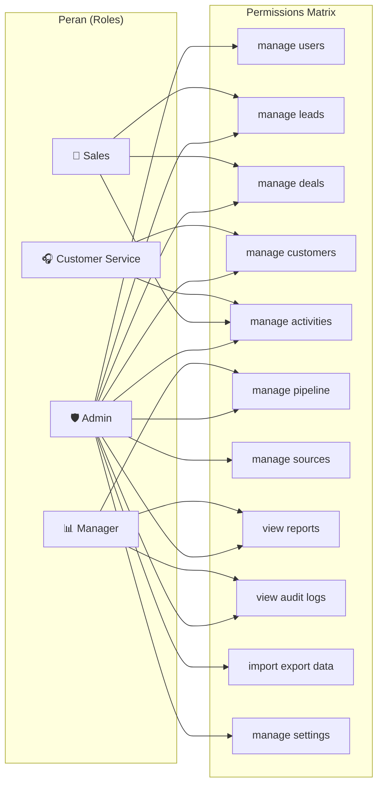
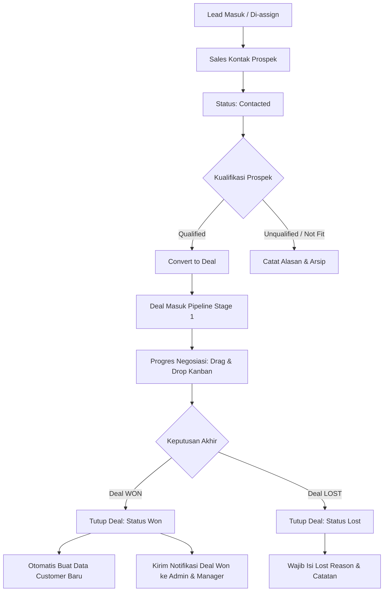
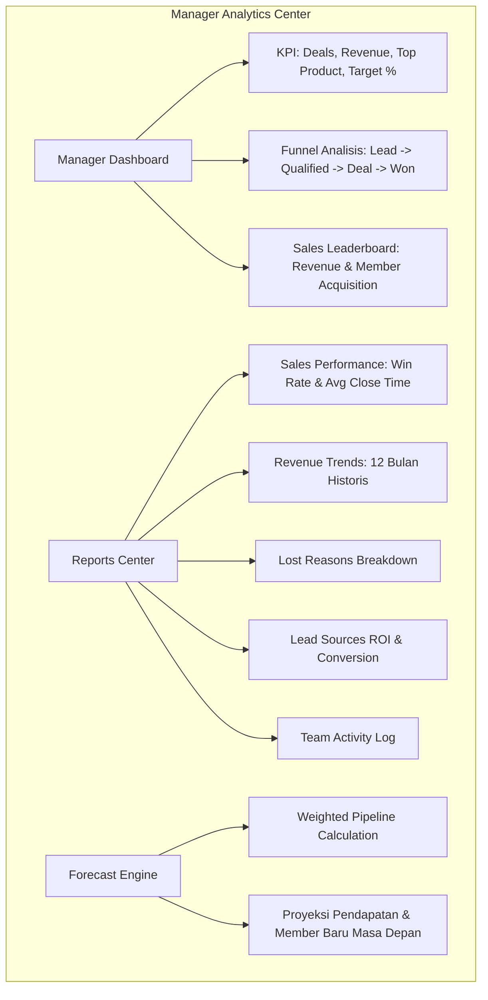
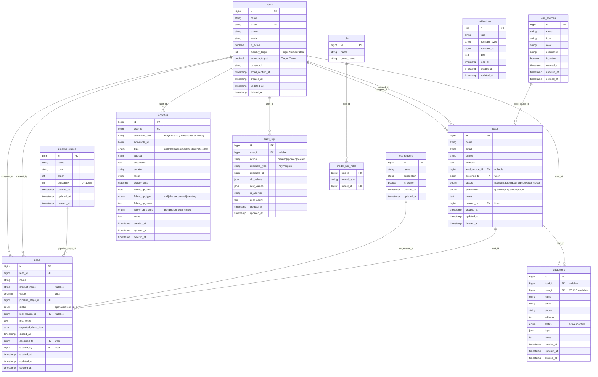
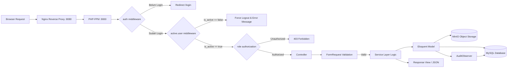
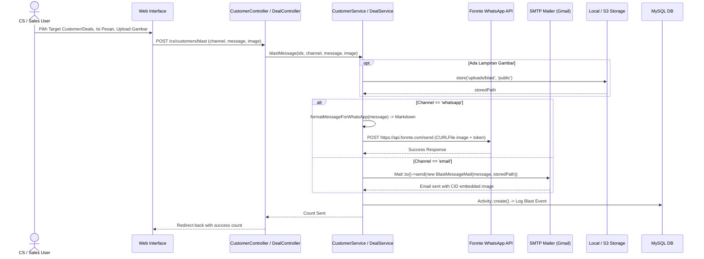

# 📊 Analisis Lengkap Project: BEAUTY_CRM

> Dokumen ini dihasilkan berdasarkan **analisis langsung source code aktual**, mencakup arsitektur kontainerisasi **Docker**, integrasi object storage **MinIO (S3)**, sistem **Multi-Channel Blast (WhatsApp & Email)**, modul **Manager Analytics & Member Forecasting**, pipeline **Drag & Drop Kanban**, serta seluruh modul operasional CRM.

---

## 1. Ringkasan Fitur & Arsitektur

**BEAUTY_CRM** adalah sistem *Customer Relationship Management* (CRM) komprehensif yang dirancang khusus untuk industri kecantikan (klinik estetika, salon, beauty studio, dan spa). Dibangun di atas **Laravel 12**, **Tailwind CSS 4**, **Alpine.js 3**, **Vite 7**, serta arsitektur **MVC + Service Layer**, sistem ini mengimplementasikan kontrol akses berbasis peran (*Role-Based Access Control*) menggunakan **Spatie Laravel Permission**.

| # | Modul / Fitur | Deskripsi |
|---|---|---|
| 1 | **Authentication & Security** | Autentikasi sesi aman, middleware verifikasi akun aktif (`CheckActiveUser`), redirect dashboard dinamis per role. |
| 2 | **User & Target Management** | Manajemen CRUD staf, role assignment, toggle status aktif/nonaktif, serta konfigurasi target bulanan (`monthly_target` & `revenue_target`). |
| 3 | **Lead Management** | Manajemen prospek dari berbagai sumber, kualifikasi lead (*qualified*, *unqualified*, *not fit*), dan distribusi tugas ke Sales. |
| 4 | **Interactive Deal Pipeline** | Kanban board interaktif dengan SortableJS (drag-and-drop antar stage), pergerakan probabilitas stage, penutupan deal (*Won*/*Lost*). |
| 5 | **Customer Management & Segmentation** | Konversi otomatis dari deal won, segmentasi tag (*VIP, Regular, dll*), tracking akumulasi belanja (*min spend*), filter interaksi terakhir. |
| 6 | **Multi-Channel Blast Messaging** | Pengiriman pesan massal terintegrasi ke Leads/Customers via **WhatsApp API (Fonnte)** & **Email (CID Inline Attachment)** dengan logging otomatis. |
| 7 | **Activity & Follow-Up System** | Pencatatan riwayat interaksi polimorfik (Call, WA, Email, Meeting, Catatan), pengingat follow-up harian, deteksi jadwal *overdue*. |
| 8 | **Manager BI & Reports Center** | Laporan performa sales, analisis akuisisi pelanggan/member, evaluasi *lost reasons*, analisis sumber lead, dan rekam jejak aktivitas tim. |
| 9 | **Pipeline & Revenue Forecasting** | Proyeksi penambahan member dan pendapatan masa depan berdasarkan probabilitas tahapan deal (*weighted pipeline value*). |
| 10 | **Import & Export Massal** | Impor lead massal via Excel/CSV (Maatwebsite Excel) dengan validasi tipe data sel, ekspor data lead, dan ekspor laporan performa ke Excel (.xlsx/.csv). |
| 11 | **Automated Audit Logging** | Pencatatan otomatis riwayat perubahan data (*create, update, delete*) menggunakan Observer pattern polimorfik, merekam IP dan User Agent. |
| 12 | **Real-Time Database Notifications** | Notifikasi in-app untuk penugasan lead baru ke Sales dan pemberitahuan deal won ke Admin & Manager. |
| 13 | **Master Data & Settings** | Manajemen master *Lead Sources*, *Pipeline Stages* (dengan drag-and-drop reorder), *Lost Reasons*, dan konfigurasi umum perusahaan. |
| 14 | **Object Storage (MinIO S3)** | Penyimpanan file avatar dan media attachment berbasis cloud storage kompatibel AWS S3 menggunakan MinIO dalam kontainer. |
| 15 | **Dockerized Infrastructure** | Orkestrasi kontainer terisolasi menggunakan Docker Compose (PHP-FPM, Nginx, MinIO, MinIO Setup) siap untuk dev & deployment. |

---

## 2. Arsitektur Infrastruktur: Docker & MinIO

Aplikasi telah dimodernisasi dengan arsitektur kontainerisasi penuh menggunakan Docker Compose, memungkinkan replikasi lingkungan yang identik di berbagai mesin.

```mermaid
graph TB
    subgraph "Host Machine (Windows / Laragon)"
        MySQL[(MySQL Server<br/>Port 3306)]
    end

    subgraph "Docker Network (beauty_network)"
        NGINX[Nginx 1.25 Alpine<br/>Container: beauty_crm_nginx<br/>Port 8080:80]
        PHP[PHP-FPM 8.2 App<br/>Container: beauty_crm_app<br/>Port 9000]
        MINIO[MinIO Server<br/>Container: beauty_crm_minio<br/>API: 9010 | Console: 9011]
        MINIO_SETUP[MinIO Setup Job<br/>Container: beauty_crm_minio_setup<br/>Auto-bucket creator]
        V_MINIO[(Volume: minio_data)]
    end

    Browser[Client Browser] -->|HTTP :8080| NGINX
    Browser -->|Console :9011| MINIO
    NGINX -->|FastCGI| PHP
    PHP -->|Storage Driver: S3| MINIO
    MINIO_SETUP -->|mc mb & public policy| MINIO
    MINIO --- V_MINIO
    PHP -->|host.docker.internal:3306| MySQL
```

### Detail Layanan Kontainer ([docker-compose.yml](file:///c:/laragon/www/BEAUTY_CRM/docker-compose.yml))

1. **`app` (PHP-FPM Container)**:
   - **Base Image**: Custom build via [docker/php/Dockerfile](file:///c:/laragon/www/BEAUTY_CRM/docker/php/Dockerfile) (PHP 8.2-FPM).
   - **Ekstensi PHP**: `pdo_mysql`, `mbstring`, `exif`, `pcntl`, `bcmath`, `gd`, `zip`, `opcache`.
   - **Konfigurasi Khusus**: `host.docker.internal:host-gateway` dipetakan agar PHP-FPM dapat menghubungi database MySQL host lokal (Laragon/MySQL port 3306).
   - **Mounting**: Root project di-mount ke `/var/www`, custom php.ini di `/usr/local/etc/php/conf.d/local.ini`.

2. **`nginx` (Web Server)**:
   - **Image**: `nginx:1.25-alpine`.
   - **Port**: `8080:80` (Aplikasi diakses melalui `http://localhost:8080`).
   - **Konfigurasi**: [docker/nginx/default.conf](file:///c:/laragon/www/BEAUTY_CRM/docker/nginx/default.conf) meneruskan request PHP ke `app:9000`.

3. **`minio` & `minio-setup` (S3 Object Storage)**:
   - **Image**: `minio/minio:latest`.
   - **Port**: `9010:9000` (API S3 Endpoint) dan `9011:9001` (Web Dashboard MinIO).
   - **Kredensial**: Root user `minioadmin` / password `minioadmin`.
   - **Setup Job**: `minio-setup` menjalankan `minio/mc` otomatis untuk membuat bucket `beauty-crm` dan mengatur permission bucket menjadi `public`.

4. **Script Setup Otomatis ([docker/setup.sh](file:///c:/laragon/www/BEAUTY_CRM/docker/setup.sh))**:
   - Menyalin `.env.docker` menjadi `.env`.
   - Membangun kontainer (`docker-compose up -d --build`).
   - Menjalankan migrasi database (`php artisan migrate --force`).
   - Membuat link storage dan membersihkan cache optimasi.

---

## 3. Arsitektur Role-Based Access Control (RBAC)

Sistem menggunakan **Spatie Laravel Permission 6.x** dengan definisi peran dan izin master pada [RoleSeeder.php](file:///c:/laragon/www/BEAUTY_CRM/database/seeders/RoleSeeder.php):



### Pemetaan Role & Hak Akses

| Role | Daftar Hak Akses (*Permissions*) | Landing Route | Prefix Rute |
|---|---|---|---|
| **Admin** | *All Permissions* (11 permissions) | `/admin/dashboard` | `routes/admin.php` (`/admin/*`) |
| **Sales** | `manage leads`, `manage deals`, `manage activities` | `/sales/dashboard` | `routes/sales.php` (`/sales/*`) |
| **Customer Service** | `manage customers`, `manage activities` | `/cs/dashboard` | `routes/cs.php` (`/cs/*`) |
| **Manager** | `view reports`, `view audit logs`, `manage pipeline` | `/manager/dashboard` | `routes/manager.php` (`/manager/*`) |

---

## 4. Analisis Mendalam Per Modul

---

### 🔐 1. Module: Autentikasi & Profil Pengguna

#### Alur Bisnis
1. User masuk ke form `/login` ([LoginController.php](file:///c:/laragon/www/BEAUTY_CRM/app/Http/Controllers/Auth/LoginController.php)).
2. Sistem memverifikasi kredensial serta kolom `is_active`. Jika user dinonaktifkan oleh Admin, sistem langsung menolak login dengan alert kesalahan.
3. Setelah login sukses, endpoint `/dashboard` ([web.php](file:///c:/laragon/www/BEAUTY_CRM/routes/web.php)) mengecek role user via helper `isAdmin()`, `isSales()`, `isCS()`, `isManager()` di [User.php](file:///c:/laragon/www/BEAUTY_CRM/app/Models/User.php) dan mengarahkan ke dashboard yang sesuai.
4. Setiap request diproteksi oleh middleware [CheckActiveUser.php](file:///c:/laragon/www/BEAUTY_CRM/app/Http/Middleware/CheckActiveUser.php). Jika user dinonaktifkan di tengah sesi aktif, sesi akan otomatis dimatikan (*force logout*).
5. Pada halaman `/profile` ([ProfileController.php](file:///c:/laragon/www/BEAUTY_CRM/app/Http/Controllers/ProfileController.php)), user dapat mengunggah avatar. File disimpan ke storage S3 MinIO (`avatars/`), dan file lama otomatis dihapus dari storage.

---

### 🛡️ 2. Module: Admin Panel & Master Data

#### Fitur & Kemampuan
* **User & Target Management**:
  - CRUD seluruh akun user staf.
  - Penentuan role dan penetapan target: `monthly_target` (jumlah member baru) dan `revenue_target` (nominal pendapatan).
  - Toggle aktif/nonaktif user via AJAX ([UserController.php](file:///c:/laragon/www/BEAUTY_CRM/app/Http/Controllers/Admin/UserController.php)). Proteksi: Admin tidak dapat menonaktifkan atau menghapus akunnya sendiri.
* **Lead Sources Management**:
  - Master data sumber prospek (WhatsApp, Instagram, Walk-in, Referral, Website, dll) dengan custom warna dan icon ([LeadSourceController.php](file:///c:/laragon/www/BEAUTY_CRM/app/Http/Controllers/Admin/LeadSourceController.php)).
* **Pipeline Stages Management**:
  - CRUD tahapan deal dengan pengaturan persentase probabilitas (*probability 0-100%*).
  - Fitur **Drag & Drop Reorder** tahapan pipeline menggunakan SortableJS via endpoint AJAX `PATCH /admin/pipeline-stages/reorder`.
* **Lost Reasons Management**:
  - Master data alasan deal gagal/lost (Harga terlalu mahal, Kompetitor, Tidak merespons, dll).
* **Audit Trail**:
  - Melihat log seluruh mutasi data dalam sistem dengan paginasi, filter user/action, dan format JSON diff ([AuditLogController.php](file:///c:/laragon/www/BEAUTY_CRM/app/Http/Controllers/Admin/AuditLogController.php)).
* **General Settings**:
  - Konfigurasi data profil perusahaan dan toggle notifikasi sistem ([SettingsController.php](file:///c:/laragon/www/BEAUTY_CRM/app/Http/Controllers/Admin/SettingsController.php)).

---

### 💼 3. Module: Sales — Lead-to-Deal Pipeline & Multi-Channel Blast

#### Alur Bisnis


#### Logika Kunci Service Layer ([DealService.php](file:///c:/laragon/www/BEAUTY_CRM/app/Services/DealService.php))
1. **`createFromLead(Lead $lead, array $data)`**:
   - Dieksekusi dalam `DB::transaction`.
   - Membuat Deal baru dan secara otomatis mengubah status Lead dari `qualified` menjadi `converted`.
2. **`moveToStage(Deal $deal, int $stageId)`**:
   - Menangani pergeseran posisi card pada Kanban Board interaktif. Menghitung ulang total nilai dan jumlah deal di setiap kolom secara instan.
3. **`closeWon(Deal $deal, ?string $productName, ?float $value)`**:
   - Mengubah status deal menjadi `won`, mencatat `closed_at`, produk yang terjual, dan nilai closing.
   - Memeriksa apakah `Customer` sudah ada dari `lead_id` terkait. Jika belum ada, sistem membuat entitas `Customer` baru secara otomatis berstatus `active`.
   - Mengirim notifikasi database [DealWonNotification.php](file:///c:/laragon/www/BEAUTY_CRM/app/Notifications/DealWonNotification.php) ke semua Admin dan Manager.
4. **`blastMessage(array $dealIds, string $channel, string $message, $image)`**:
   - Mengirim pesan broadcast ke prospek terkait deal terpilih via WhatsApp (API Fonnte) atau Email, menyertakan gambar attachment (CID).

---

### 🎧 4. Module: Customer Service (CS) & Relationship Management

#### Alur Bisnis & Layanan Purna Jual
1. **Customer Database & Segmentation**:
   - CS mengelola basis data pelanggan yang bersumber dari Deal Won maupun input manual ([CustomerController.php](file:///c:/laragon/www/BEAUTY_CRM/app/Http/Controllers/CS/CustomerController.php)).
   - Menampilkan total akumulasi transaksi belanja pelanggan (*total spend* yang dihitung dari relasi deal won).
   - Pengelompokan tagging fleksibel (*JSON array: VIP, Regular, Treatment Jerawat, dll*).
2. **Multi-Channel Blast Pesan Massal ([CustomerService::blastMessage](file:///c:/laragon/www/BEAUTY_CRM/app/Services/CustomerService.php#L110-L196))**:
   - **WhatsApp Blast**: Mengonversi teks HTML menjadi format WhatsApp Markdown (*bold*, _italic_, ~strike~) dan mengirim via cURL ke Fonnte API (`https://api.fonnte.com/send`) menggunakan `CURLFile` untuk upload gambar promosi/konsultasi.
   - **Email Blast**: Mengirim email promosi via [BlastMessageMail.php](file:///c:/laragon/www/BEAUTY_CRM/app/Mail/BlastMessageMail.php) dengan sistem *Content-ID (CID) inline embedding* gambar.
   - Setiap pengiriman blast otomatis tercatat ke dalam tabel `activities` sebagai riwayat interaksi pelanggan.
3. **Follow-Up Scheduling & Overdue Management**:
   - Menjadwalkan pengingat follow-up pasca-treatment atau jadwal kunjungan ulang.
   - Filter otomatis untuk membedakan follow-up **Hari Ini**, **Akan Datang**, dan **Overdue** (melewati jatuh tempo).
   - Tombol penyelesaian follow-up satu klik (*mark as completed*).

---

### 📊 5. Module: Manager — Business Intelligence, Analytics & Member Forecasting

Modul Manager dikuasakan oleh [ReportService.php](file:///c:/laragon/www/BEAUTY_CRM/app/Services/ReportService.php) yang memisahkan seluruh kalkulasi statistik dari controller.



#### Komponen Utama Laporan Manager:
1. **Sales Performance Report**:
   - Analisis mendalam kinerja tiap salesperson: Total leads, jumlah deal won vs lost, rasio konversi (*win rate*), dan rata-rata durasi penutupan transaksi (*average days to close*).
2. **Member Acquisition & Revenue Target**:
   - Perbandingan target bulanan (`monthly_target` & `revenue_target`) terhadap realisasi pencapaian (*target achievement percentage*).
3. **Pipeline & Revenue Forecasting Engine ([ForecastController.php](file:///c:/laragon/www/BEAUTY_CRM/app/Http/Controllers/Manager/ForecastController.php))**:
   - Mengombinasikan data rata-rata nilai transaksi historis (*average deal value*) dengan probabilitas stage pipeline untuk menghasilkan nilai terbobot (*weighted forecast value*):
     $$\text{Forecast Value} = \sum (\text{Average Deal Value} \times \text{Stage Probability})$$
4. **Laporan Sumber Prospek & Alasan Kalah**:
   - Diagram distribusi efektivitas channel pemasaran (*Lead Sources*) dan identifikasi hambatan penjualan (*Lost Reasons breakdown*).
5. **Ekspor Data**:
   - Ekspor laporan kinerja ke format `.xlsx` atau `.csv` via [SalesPerformanceExport.php](file:///c:/laragon/www/BEAUTY_CRM/app/Exports/SalesPerformanceExport.php) dan [RevenueExport.php](file:///c:/laragon/www/BEAUTY_CRM/app/Exports/RevenueExport.php).

---

## 5. Entity Relationship Diagram (ERD) Aktual

Berikut struktur relasi basis data aktual berdasarkan seluruh file migrasi pada direktori [database/migrations/](file:///c:/laragon/www/BEAUTY_CRM/database/migrations/):



---

## 6. Diagram Alur & Logika Sistem

### A. Diagram Request Lifecycle & Security Middleware



### B. Diagram Sequence: Multi-Channel Blast Messaging



---

## 7. Diagram Komponen Arsitektur Sistem

```mermaid
graph TB
    subgraph "Frontend Layer"
        BLADE[Blade Templates]
        TAILWIND[Tailwind CSS 4.0]
        ALPINE[Alpine.js 3.x]
        SORTABLE[SortableJS (Kanban Drag & Drop)]
        CHART[Chart.js (Visualisasi Metrik)]
    end

    subgraph "Application Layer (Laravel 12)"
        subgraph "Routing & Security"
            RT_ADMIN[routes/admin.php]
            RT_SALES[routes/sales.php]
            RT_CS[routes/cs.php]
            RT_MGR[routes/manager.php]
            MW_ACTIVE[CheckActiveUser Middleware]
            SPATIE[Spatie Role Middleware]
        end

        subgraph "Controllers"
            CTRL_ADMIN[Admin Controllers - 11 files]
            CTRL_SALES[Sales Controllers - 5 files]
            CTRL_CS[CS Controllers - 4 files]
            CTRL_MGR[Manager Controllers - 6 files]
            CTRL_GEN[Profile & Notification Controllers]
        end

        subgraph "Service Layer"
            SVC_DEAL[DealService]
            SVC_CUST[CustomerService]
            SVC_REP[ReportService]
            SVC_IMP[ImportExportService]
        end

        subgraph "Background & Observers"
            OBS_AUDIT[AuditObserver]
            PROV_AUDIT[AuditServiceProvider]
            NOTIF_DEAL[DealWonNotification]
            NOTIF_LEAD[LeadAssignedNotification]
            MAIL_BLAST[BlastMessageMail]
        end
    end

    subgraph "Infrastructure & Storage"
        STORAGE_S3[(MinIO S3 Bucket: beauty-crm)]
        DB_MYSQL[(MySQL 8.0 Database)]
        FONNTE_API[Fonnte WhatsApp Gateway]
    end

    BLADE --- ALPINE & SORTABLE & CHART
    BLADE --> RT_ADMIN & RT_SALES & RT_CS & RT_MGR
    RT_ADMIN & RT_SALES & RT_CS & RT_MGR --> MW_ACTIVE --> SPATIE
    SPATIE --> CTRL_ADMIN & CTRL_SALES & CTRL_CS & CTRL_MGR & CTRL_GEN
    CTRL_ADMIN & CTRL_SALES & CTRL_CS & CTRL_MGR --> SVC_DEAL & SVC_CUST & SVC_REP & SVC_IMP
    SVC_DEAL & SVC_CUST & SVC_REP & SVC_IMP --> DB_MYSQL
    SVC_CUST & SVC_DEAL --> FONNTE_API
    SVC_CUST & SVC_DEAL --> MAIL_BLAST
    CTRL_GEN & SVC_CUST --> STORAGE_S3
    SVC_DEAL & SVC_CUST & SVC_REP --> OBS_AUDIT --> DB_MYSQL
```

---

## 8. Penjelasan Struktur Folder Proyek

```
BEAUTY_CRM/
├── app/
│   ├── Exports/                      # Ekspor Excel (Maatwebsite Excel)
│   │   ├── LeadExport.php            # Ekspor data leads
│   │   ├── RevenueExport.php         # Ekspor laporan pendapatan
│   │   └── SalesPerformanceExport.php# Ekspor performa sales
│   ├── Http/
│   │   ├── Controllers/
│   │   │   ├── Admin/                # 11 Controller (User, Lead, Master Data, Settings)
│   │   │   ├── Auth/                 # LoginController
│   │   │   ├── CS/                   # 4 Controller (Customer, FollowUp, Activity, Dashboard)
│   │   │   ├── Manager/              # 6 Controller (Reports, Pipeline, Forecast, Team, Audit)
│   │   │   ├── Sales/                # 5 Controller (Leads, Deals, Activities, Dashboard, Customer)
│   │   │   ├── Controller.php        # Base Controller
│   │   │   ├── NotificationController.php
│   │   │   └── ProfileController.php # Manajemen Profil & Avatar MinIO
│   │   ├── Middleware/
│   │   │   └── CheckActiveUser.php   # Proteksi status aktif akun user
│   │   └── Requests/                 # Form Request Validation Classes (Admin, CS, Manager, Sales)
│   ├── Imports/
│   │   └── LeadImport.php            # Impor massal Excel dengan casting numerik sel
│   ├── Mail/
│   │   └── BlastMessageMail.php      # Mailable broadcast email dengan CID image attachment
│   ├── Models/                       # 9 Eloquent Model Utama
│   │   ├── Activity.php              # Polimorfik interaksi & follow-up
│   │   ├── AuditLog.php              # Polimorfik mutasi data audit trail
│   │   ├── Customer.php              # Basis data customer & aggregasi belanja
│   │   ├── Deal.php                  # Transaksi pipeline & produk
│   │   ├── Lead.php                  # Prospek & kualifikasi
│   │   ├── LeadSource.php            # Master sumber lead
│   │   ├── LostReason.php            # Master alasan deal gagal
│   │   ├── PipelineStage.php         # Master tahapan deal & bobot probabilitas
│   │   └── User.php                  # Staf, roles, target bulanan, accessor avatar MinIO
│   ├── Notifications/                # Database Notification (LeadAssigned, DealWon)
│   ├── Observers/
│   │   └── AuditObserver.php         # Observer pencatat audit log otomatis
│   ├── Providers/
│   │   ├── AppServiceProvider.php
│   │   └── AuditServiceProvider.php  # Registrasi model yang di-observe audit
│   └── Services/                     # Business Logic Layer (Clean Code)
│       ├── CustomerService.php       # Logika Customer, Follow-up, WA & Email Blast
│       ├── DealService.php           # Logika Pipeline, Stage Movement, Conversion, Deal Blast
│       ├── ImportExportService.php   # Handler upload & template Excel
│       └── ReportService.php         # Kalkulator Agregasi BI, Funnel, Forecast & Performance
├── config/
│   ├── filesystems.php               # Konfigurasi disk local, public, dan S3 (MinIO)
│   └── services.php                  # Konfigurasi Fonnte WA token & provider pihak ketiga
├── database/
│   ├── migrations/                   # 17 Migration database
│   └── seeders/                      # RoleSeeder, AdminUserSeeder, Master Data Seeders
├── docker/
│   ├── nginx/
│   │   └── default.conf              # Konfigurasi Nginx reverse proxy
│   ├── php/
│   │   ├── Dockerfile                # Image build PHP 8.2-FPM + Ekstensi
│   │   └── local.ini                 # Konfigurasi runtime PHP
│   └── setup.sh                      # Shell script setup 1-klik lingkungan Docker
├── docker-compose.yml                # Orkestrasi Docker (App, Nginx, MinIO, MinIO Setup)
├── .env.docker                       # Template environment khusus container Docker
├── routes/
│   ├── web.php                       # Entrypoint auth, profile, redirect role
│   ├── admin.php                     # Rute khusus Role Admin
│   ├── sales.php                     # Rute khusus Role Sales
│   ├── cs.php                        # Rute khusus Role Customer Service
│   └── manager.php                   # Rute khusus Role Manager
└── resources/
    ├── js/                           # Script JS, Alpine.js, SortableJS, Chart.js
    └── views/                        # Blade Templates per Role & Shared Layouts
```

---

## 9. Analisis Keamanan & Kualitas Kode

### ✅ Peningkatan yang Telah Diimplementasikan (*Fixed & Verified*)

1. **Integrasi MinIO S3 Object Storage**:
   - Avatar pengguna dan berkas blast dikelola secara terpusat melalui disk S3/MinIO, mencegah pembebanan penyimpanan lokal container.
2. **Koreksi Relasi Notifikasi `DealWonNotification`**:
   - Penggunaan relasi sudah diperbaiki merujuk ke `$deal->assignedUser` secara konsisten (menggantikan bug referensi lama `$deal->sales`).
3. **Penyempurnaan Impor Excel Numerik**:
   - `LeadImport` telah menangani *type casting* otomatis untuk nomor telepon numerik dari file Excel agar tidak terjadi error validasi string.
4. **Namespace Service Provider Terstandarisasi**:
   - [AuditServiceProvider.php](file:///c:/laragon/www/BEAUTY_CRM/app/Providers/AuditServiceProvider.php) telah berada di direktori `app/Providers/` dengan namespace `App\Providers`.
5. **Drag-and-Drop Kanban Stabil**:
   - Endpoint pemindahan stage pipeline (`deals.move-stage` dan `pipeline-stages.reorder`) telah mendukung pembaruan asinkronus (*real-time badge & value update*) tanpa konflik parsing token class.
6. **Multi-Channel Delivery Logging**:
   - Pengiriman pesan broadcast (WhatsApp via Fonnte & Email CID) otomatis meng-inject catatan riwayat ke tabel `activities`.

### ⚠️ Catatan Rekomendasi Lanjutan

1. **Rate Limiting Login**:
   - Direkomendasikan menambahkan `throttle:5,1` pada route `POST /login` di [routes/web.php](file:///c:/laragon/www/BEAUTY_CRM/routes/web.php) untuk mitigasi brute force attack.
2. **Queueing untuk Pengiriman Pesan Massal**:
   - Untuk data blast berskala ribuan customer/deal, proses cURL WhatsApp dan SMTP Email direkomendasikan dialihkan menggunakan Laravel Queue (`ShouldQueue` job).
3. **Penyimpanan Pengaturan ke Basis Data**:
   - Memindahkan penyimpanan pengaturan [SettingsController.php](file:///c:/laragon/www/BEAUTY_CRM/app/Http/Controllers/Admin/SettingsController.php) dari penulisan file `.env` langsung ke tabel basis data `settings` untuk kepatuhan *12-Factor App*.
